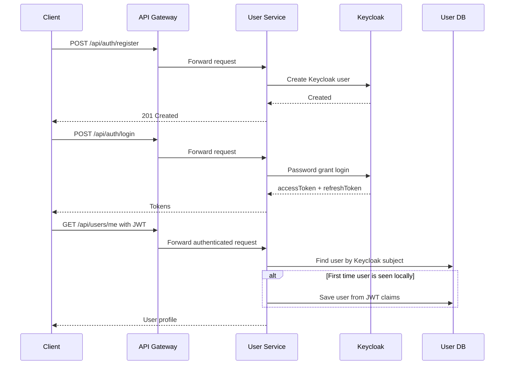
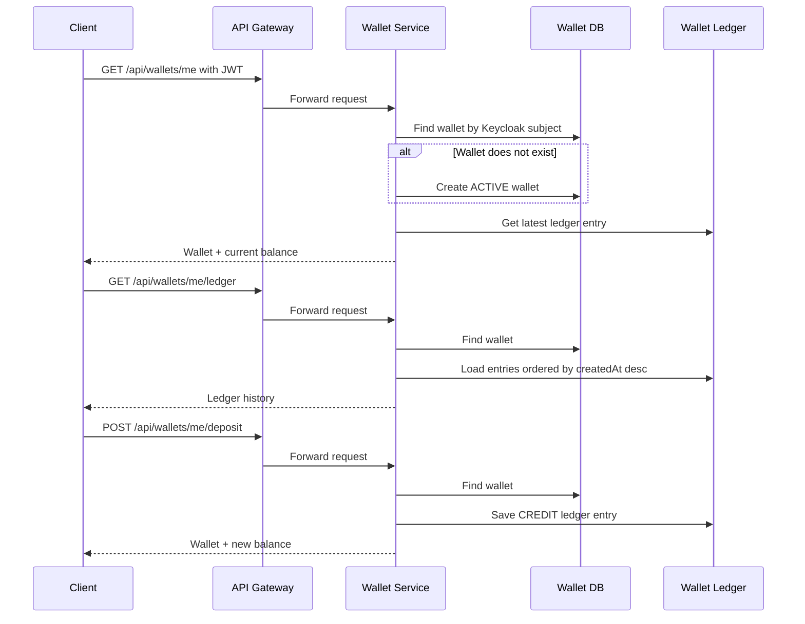
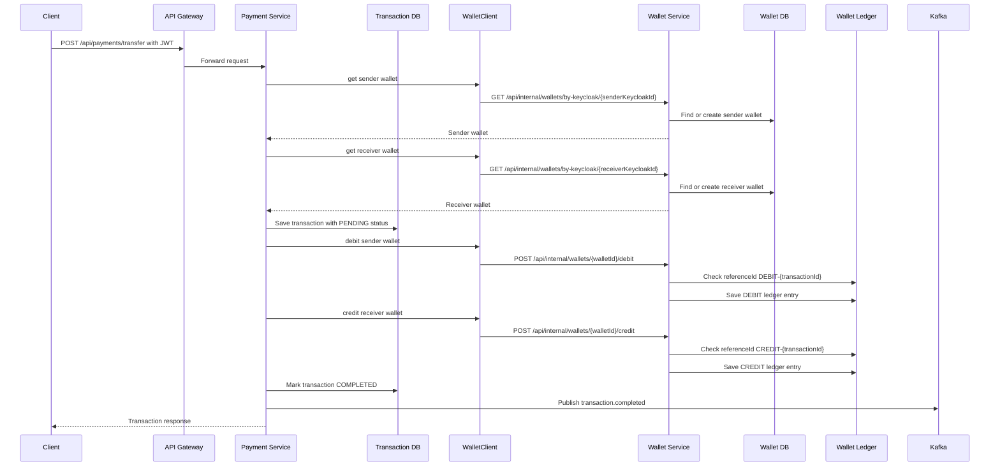
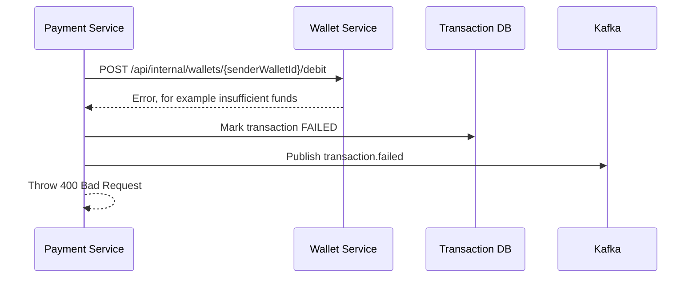
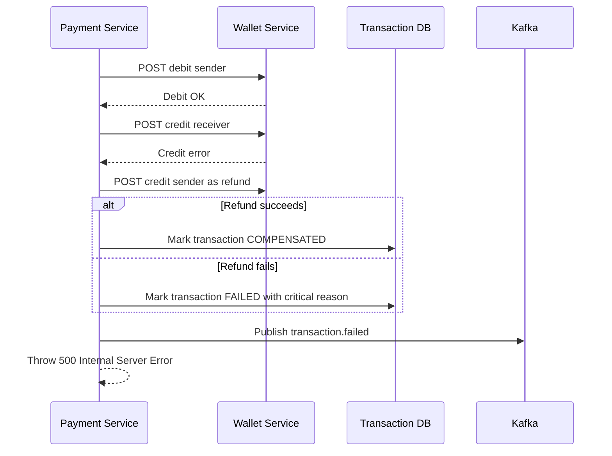

# Digital Wallet Workflow Sequence

This project is a Spring microservices backend with these main services:

- `api-gateway`: public entry point on port `8085`
- `user-service`: authentication and user profile sync
- `wallet-service`: wallet balance and wallet ledger entries
- `payment-service`: transfer orchestration and transaction records
- `discovery-service`: Eureka service discovery
- `keycloak`: authentication server
- `kafka`: event broker for transaction outcome events

## Important Summary

Most business operations are HTTP-based right now.

Kafka is active in `payment-service` only after a transaction outcome:

- success publishes to `transaction.completed`
- failure publishes to `transaction.failed`

There is currently no `@KafkaListener` consumer in the codebase, so Kafka events are emitted but not consumed by another service yet.

The wallet and wallet-ledger are not called through Kafka. They are called through HTTP and direct service/repository calls inside `wallet-service`.

## Public HTTP Entry Points

External clients should call the API Gateway:

```text
http://localhost:8085
```

Gateway route mapping:

```text
/api/auth/**     -> user-service
/api/users/**    -> user-service
/api/wallets/**  -> wallet-service
/api/payments/** -> payment-service
```

The internal wallet endpoints are under:

```text
/api/internal/wallets/**
```

Those endpoints are intended for service-to-service calls from `payment-service` to `wallet-service`, not for public clients.

## Authentication And User Sync



Notes:

- Registration creates the user in Keycloak.
- The local `user-service` database is synced lazily when `/api/users/me` is called.
- `UserSyncService` imports/declares a `KafkaTemplate`, but it is not injected or used, so it does not currently publish wallet creation events.

## Wallet Read And Deposit Flow



Notes:

- `POST /api/wallets/me/deposit` is marked in code as a testing endpoint.
- The wallet balance is not stored as a mutable balance field. It is derived from the latest `wallet_ledger.balanceAfter`.
- Every debit or credit creates a ledger row.

## Transfer Flow

This is the main place where `payment-service`, `wallet-service`, transactions, wallet, wallet-ledger, HTTP, and Kafka all meet.



## Transfer Failure Paths

### Debit Fails



No compensation is needed because the sender was never debited.

### Credit Fails After Debit Succeeds



This is an orchestration Saga pattern: `payment-service` coordinates the steps and performs compensation if the second step fails.

## Where Kafka Is Activated

Kafka infrastructure exists in Docker:

```text
zookeeper
kafka
```

`payment-service` connects to Kafka using:

```text
spring.kafka.bootstrap-servers=kafka:29092
```

`payment-service` defines these topics:

```text
transaction.completed
transaction.failed
```

`payment-service` publishes events in three places:

```text
Debit failed                 -> transaction.failed
Credit failed / compensated  -> transaction.failed
Transfer completed           -> transaction.completed
```

Current limitation:

```text
No service currently consumes these Kafka events.
```

So Kafka is currently useful for future extensions such as notifications, audit processing, emails, analytics, fraud checks, or async reporting, but it is not required for wallet balance movement in the current code.

## HTTP Calls Between Services

These are the internal HTTP calls made by `payment-service` to `wallet-service` through `WalletClient`:

```text
GET  {wallet.service.url}/api/internal/wallets/by-keycloak/{keycloakId}
POST {wallet.service.url}/api/internal/wallets/{walletId}/debit
POST {wallet.service.url}/api/internal/wallets/{walletId}/credit
```

In Docker:

```text
wallet.service.url=http://wallet-service:8082
```

The current JWT is copied from the Spring Security context and forwarded as:

```text
Authorization: Bearer <token>
```

## Transaction Versus Wallet Ledger

`Transaction` belongs to `payment-service`.

It records the business transfer:

```text
senderKeycloakId
receiverKeycloakId
senderWalletId
receiverWalletId
amount
status: PENDING, COMPLETED, FAILED, COMPENSATED
failureReason
createdAt
```

`WalletLedger` belongs to `wallet-service`.

It records actual wallet movements:

```text
wallet
ledgerType: CREDIT or DEBIT
amount
balanceAfter
description
referenceId
createdAt
```

In other words:

- `Transaction` says "a transfer was requested and what happened to it."
- `WalletLedger` says "money moved in or out of a specific wallet."

## Best-Practice Shape Of This Project

The current project is using a reasonable microservice pattern:

- Public clients call the gateway, not internal services directly.
- Authentication is centralized through Keycloak and JWT validation.
- `payment-service` owns transfer orchestration.
- `wallet-service` owns wallet state and ledger entries.
- Wallet mutations are idempotent through `referenceId`.
- Transfer failures use Saga-style compensation.
- Kafka is used for domain events after transaction outcomes.

Two things to keep in mind:

- Since Kafka has no consumers yet, it is not driving the workflow. It is only publishing outcome events.
- The internal wallet endpoints should remain protected from external callers. The README already says `/api/internal/**` should stay blocked at the gateway.

